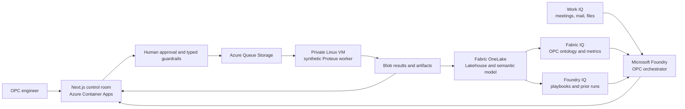

# OPC IQ Demo Architecture

## Purpose

This solution demonstrates how an OPC engineering team can reduce time-to-result by combining adaptive parameter exploration, governed enterprise context, and elastic Azure compute. It emulates the command and result boundary of an OPC tool; it does not emulate Synopsys algorithms or use licensed product assets.

## Responsibility Boundaries

| Plane | Responsibility | Must not do |
| --- | --- | --- |
| Work IQ | User-scoped business context, owners, meetings, approval intent | Read content the caller cannot access |
| Fabric IQ | Shared OPC semantics and analytical facts | Replace deterministic engineering validation |
| Foundry IQ | Permission-aware retrieval over playbooks and prior experiments | Receive raw GDS, PDK, masks, or license material |
| Foundry agent | Explain evidence and propose bounded experiments | Generate arbitrary shell commands |
| Next.js control plane | Validate schemas, enforce approval, dispatch jobs, show lineage | Bypass approval or execute recipe text |
| VM/Slurm compute plane | Run deterministic EDA jobs against protected data | Send proprietary artifacts to an LLM |

## OPC Data Model

Fabric IQ should model these entities and relationships:

- `Design` has `Layer` and `PatternClass`.
- `Recipe` has typed parameters, parent recipe, optimizer generation, and approval.
- `SimulationRun` executes one recipe on one process-condition set.
- `SimulationRun` produces `OpcMetric` values and artifact references.
- `Recommendation` cites Work IQ, Fabric IQ, and Foundry IQ evidence.
- `Approval` and `AuditEvent` preserve actor, timestamp, target, and hash lineage.

Core metrics are EPE p95, PV Band, defect risk ppm, process-window score, runtime, queue wait, compute cost, feasible-candidate ratio, and time-to-first-feasible recipe.

## Production Evolution

The demo VM implements the same queue-to-result contract expected from a production EDA gateway. Replace it with CycleCloud Slurm or an existing Slurm cluster, stage protected input through private endpoints, mount Azure Managed Lustre or Azure NetApp Files where appropriate, and use license-aware Slurm scheduling. Scale workers independently while keeping the control and intelligence planes stable.

The honest performance claim is fewer experiments and more parallelism, not that Azure changes the numerical runtime of a single identical Proteus simulation. A production benchmark must compare equivalent image, CPU, memory, storage, network, license availability, recipe, and input data.

## Example Scenarios

1. **Line-end recovery:** retrieve prior line-end experiments, propose serif/bias combinations, run only high-information candidates, and preserve citations.
2. **Process-window widening:** optimize across dose/focus corners and rank recipes by worst-case EPE and PV Band.
3. **Runtime guardrail:** cap fragmentation and stop dominated candidates early while preserving quality thresholds.
4. **Cloud burst:** keep baseline jobs on premises and burst queued corners or pattern classes to CycleCloud Slurm.
5. **Knowledge flywheel:** write accepted/rejected runs to OneLake so later campaigns use the same governed history.